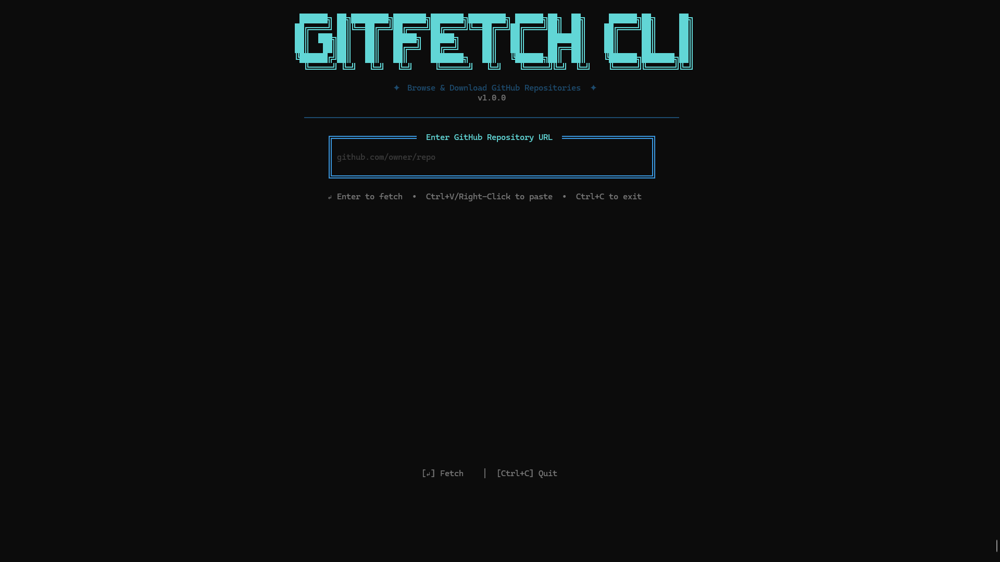
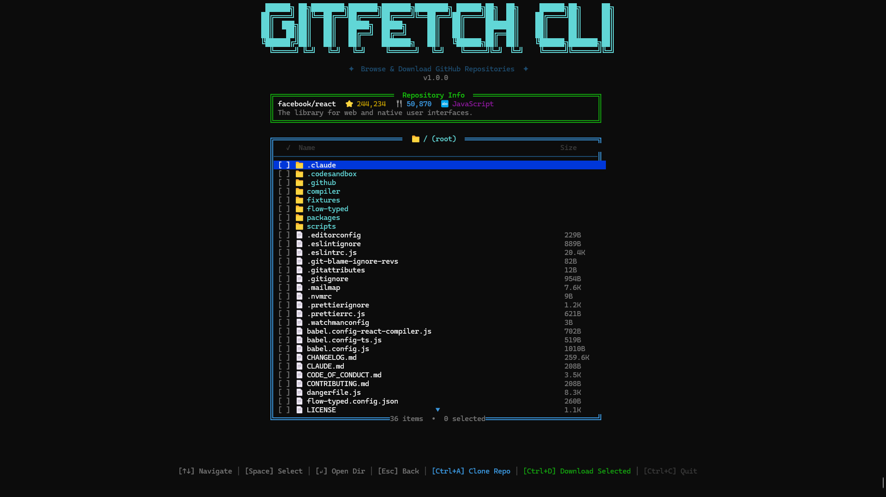
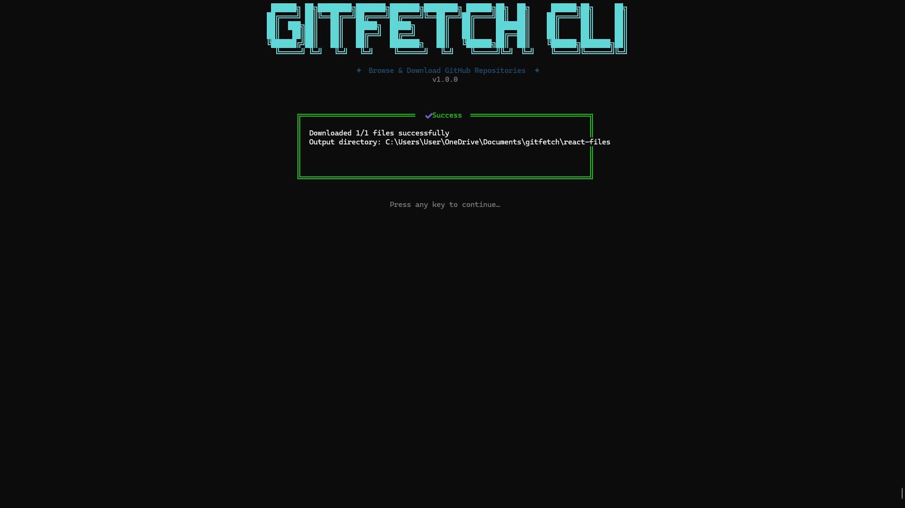

<div align="center">


<br/>

# gitfetch

### Paste a GitHub link. Pick your files. Done.

**No syntax. No bloat. No friction.**

<br/>

[](https://www.npmjs.com/package/gitfetch-cli)
[](https://www.npmjs.com/package/gitfetch-cli)
[](./LICENSE)
[](https://nodejs.org)

<br/>

```bash
npx gitfetch
```

</div>

---

<br/>

## 😩 The old way

```bash
git clone https://github.com/some/massive-repo
cd massive-repo
# congrats, you now have 4,000 files you don't need
# spend 10 minutes deleting everything except the 2 files you wanted
```

## 🚀 The gitfetch way

```bash
npx gitfetch
# Paste your URL → Browse the tree → Pick your files → Done
```

<br/>

---

## 🎬 How It Works

<br/>

**① Paste your link**


Run `npx gitfetch` and paste any GitHub URL straight from your browser. No shorthand, no docs, no thinking.

<br/>

**② Browse & select**


Navigate the full file tree right in your terminal. Open folders, explore the structure, and hit `Space` to select exactly what you want.

<br/>

**③ Download only what you need**


Clone the whole repo or grab just the selected files. Zero bloat, clean output.

<br/>

---

## ✨ Features

| | |
|---|---|
| 🔗 **Paste any URL** | Full GitHub links work. No `user/repo` syntax to memorize. |
| 📁 **File picker** | Select specific files and folders — not just the whole repo. |
| ⚡ **Zero install** | `npx gitfetch` and you're running. No global install needed. |
| 🎨 **Beautiful TUI** | A terminal UI that's actually nice to look at. |
| 🔑 **Token support** | Optional GitHub token to avoid rate limits. |
| 🧠 **Smart parsing** | Handles full URLs, shorthand, branches — all of it. |

<br/>

---

## 🚀 Getting Started

**Recommended — zero install**
```bash
npx gitfetch
```

**Or install globally**
```bash
npm install -g gitfetch-cli
gitfetch
```

<br/>

---

## ⌨️ Keyboard Shortcuts

| Key | Action |
|-----|--------|
| `↑ / ↓` | Navigate files |
| `Space` | Select / deselect |
| `Enter` | Open folder |
| `Esc` | Go back |
| `Ctrl + A` | Clone entire repo |
| `Ctrl + D` | Download selected files |
| `Ctrl + C` | Exit |

<br/>

---

## 🔑 GitHub Token *(Optional)*

By default you get **60 API requests/hour**. To increase that to 5,000/hour:

```bash
# macOS / Linux
export GITHUB_TOKEN=ghp_your_token_here

# Windows
set GITHUB_TOKEN=ghp_your_token_here
```

→ [Generate a token](https://github.com/settings/tokens) — no special scopes needed for public repos.

<br/>

---

## 🛠️ Requirements

- Node.js 18+
- Git installed

<br/>

---

## 🗺️ Roadmap

- [x] GitHub
- [ ] GitLab
- [ ] Bitbucket
- [ ] Azure DevOps
- [ ] Auto install dependencies after download
- [ ] Open in VS Code after cloning

<br/>

---

## 🤝 Contributing

```bash
git clone https://github.com/argho0279-ship-it/gitfetch.git
cd gitfetch
npm install
npm run build
npm start
```

PRs and issues are welcome!

<br/>

---

<div align="center">

**Built for developers who move fast.**

[npm](https://www.npmjs.com/package/gitfetch-cli) · [Issues](https://github.com/argho0279-ship-it/gitfetch/issues) · [Pull Requests](https://github.com/argho0279-ship-it/gitfetch/pulls)

<br/>

*If gitfetch saved you even 30 seconds — a ⭐ means the world to an indie dev.*

</div>
- **Keyboard Navigation**:
  - `↑/↓` - Navigate files
  - `Space` - Select/deselect files
  - `Enter` - Open folders
  - `Esc` - Go back
  - `Ctrl+A` - Download all (clone)
  - `Ctrl+D` - Download selected files
  - `Ctrl+C` - Exit

---

## 🚀 Installation

```bash
# Using npx (no installation needed)
npx gitfetch

# Or install globally
npm install -g gitfetch-cli
gitfetch
```

---

## 📖 Usage

### 1. Launch the CLI

```bash
npx gitfetch
```

<p align="center">
  
</p>

### 2. Enter a GitHub Repository URL

Type or paste a GitHub URL, for example:
- `facebook/react`
- `https://github.com/microsoft/vscode`
- `owner/repo`

Press **Enter** to fetch the repository.

<p align="center">
  
</p>

### 3. Browse Files

Use arrow keys to navigate the file tree:
- `↑/↓` to move
- `Space` to select files
- `Enter` to open folders
- `Esc` to go back

<p align="center">
  
</p>

### 4. Download

Choose your download option:
- **`Ctrl+A`** - Clone the entire repository (uses git)
- **`Ctrl+D`** - Download only selected files

---

## ⌨️ Keyboard Shortcuts

| Key | Action |
|-----|--------|
| `↑/↓` | Navigate files |
| `Space` | Select/deselect file |
| `Enter` | Open folder |
| `Esc` | Go to parent folder |
| `Ctrl+A` | Clone entire repo |
| `Ctrl+D` | Download selected files |
| `Ctrl+C` | Exit |

---

## 🔧 Requirements

- **Node.js** 18+
- **Git** (for cloning repositories)
- **Windows Terminal** or **iTerm2** (macOS) / **gnome-terminal** (Linux)

---

## 🌐 Environment Variables

| Variable | Description |
|----------|-------------|
| `GITHUB_TOKEN` | Your GitHub personal access token (to avoid rate limits) |

### Setting up GitHub Token (Optional)

If you hit GitHub API rate limits, create a personal access token:

1. Go to [GitHub Settings → Tokens](https://github.com/settings/tokens)
2. Generate a new token (classic)
3. Set it as an environment variable:

```bash
# Windows
set GITHUB_TOKEN=your_token_here
gitfetch

# Linux/macOS
export GITHUB_TOKEN=your_token_here
gitfetch
```

---

## 🛠️ Development

```bash
# Clone the repo
git clone https://github.com/yourusername/gitfetch-cli.git
cd gitfetch-cli

# Install dependencies
npm install

# Build
npm run build

# Run
npm start
# or
node dist/index.js
```

---

## 📝 License

MIT License - feel free to use and modify!

---

## 🙏 Acknowledgments

- [Ink](https://github.com/vadimdemedes/ink) - TUI framework inspiration
- [Chalk](https://github.com/chalk/chalk) - Terminal styling
- All contributors and users!

---

## NPM link

https://www.npmjs.com/package/gitfetch-cli

---

<p align="center">
  Made with ❤️ for developers who ❤️ the terminal
</p>
<p align="center">
Please leave a star if its a cool and you like it
</p>
